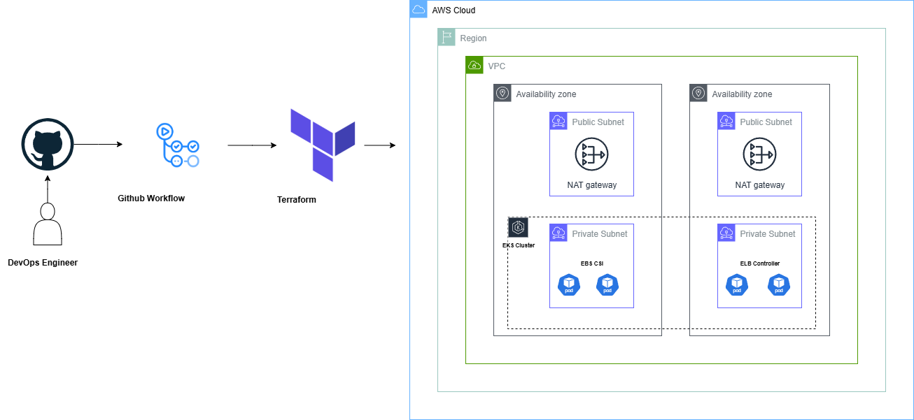

# 🚀 DevOps Project: AWS EKS with Terraform & GitHub Actions  

## 📌 Project Overview  
This project provisions a **production-ready Kubernetes cluster on AWS (EKS)** using **Terraform** and automates the deployment process with **GitHub Actions**.  

It includes:  
- **VPC setup** (subnets, route tables, internet/NAT gateways)  
- **EKS cluster** creation with node groups  
- **EBS CSI Driver** for dynamic storage provisioning  
- **AWS Load Balancer Controller** for Ingress support  
- **CI/CD pipeline** with GitHub Actions to automate Terraform workflows  

The goal is to demonstrate **Infrastructure as Code (IaC)** and **CI/CD practices** in a real-world DevOps environment.  

---

## 🏗️ Architecture  
1. **Terraform** provisions:  
   - VPC with public/private subnets  
   - EKS Cluster with worker nodes  
   - IAM roles & policies for EKS addons  
2. **Addons installed**:  
   - **EBS CSI Driver** → for persistent storage  
   - **AWS Load Balancer Controller** → for ingress/ELB  
3. **GitHub Actions Workflow**:  
   - Runs `terraform fmt` & `terraform validate`  
   - Plans infrastructure changes on PRs  
   - Applies changes on merge to `main`  

---

## 🏗️ Architecture Diagram



## ⚙️ Tools & Technologies  
- **AWS** (VPC, EKS, IAM, EBS, ELB)  
- **Terraform** (IaC)  
- **GitHub Actions** (CI/CD pipeline)  
- **Kubernetes** (EKS cluster management)  

---

## 📂 Project Structure 
```yaml 
.
├── .github/
│   └── workflows/
│       └── deploy.yml            # GitHub Actions pipeline for Terraform
├── envs/
│   ├── pre-prod/
│   └── prod/
├── modules/                      # Terraform reusable modules
│   ├── Network/                  # VPC module
│   │   ├── vpc-module.tf
│   │   ├── vpc-variables.tf
│   │   └── vpc-outputs.tf
│   ├── eks/                      # EKS cluster module
│   │   ├── eks-cluster.tf
│   │   ├── eks-variables.tf
│   │   └── eks-outputs.tf
│   │   ├── eks-node-group-private.tf
│   │   ├── iam-oidc-connect-povider.tf
│   │   ├── iamrole-eks-nodegroup.tf
│   │   ├── iamrole-eks-cluster.tf
│   │   └── ami-datasource.tf
│   ├── EBS/                      # Addons module (EBS CSI)
│   │   ├── ebs-csi-install-useing-helm.tf
│   │   ├── ebs-csi-variables.tf
│   │   ├── ebs-csi-outputs.tf
│   │   ├── ebs-csi-iam-policy-and-role.tf
│   │   └── ebs-csi-datasources.tf
│   └── ALB/                      # Addons module (ALB Controller)
│       ├── lbc-install.tf
│       ├── output.tf
│       ├── variable.tf
│       ├── lbc-iam-policy-and-role.tf
│       ├── lbc-datasource.tf
│       └── ingress-class.tf
├── main.tf                       # Root Terraform config (calls modules)
├── variables.tf                  # Input variables
├── outputs.tf                    # Outputs
├── provider.tf                   # AWS provider config
├── versions.tf                   # Required providers/versions
├── backend.tf                    # Remote state backend (S3 + DynamoDB)
└── README.md                     # Documentation
```

## 🚦 GitHub Actions Workflow  
Example workflow (`.github/workflows/deploy.yml`):  

```yaml
name: zone infra cicd

on:
  push:
    branches:
      - preprod
      - prod

jobs:
  terraform-pre-prod:
    if: github.ref == 'refs/heads/preprod'
    runs-on: ubuntu-latest
    defaults:
      run:
        working-directory: envs/pre-prod
    steps:
      - name: Checkout code
        uses: actions/checkout@v4

      - name: Configure AWS credentials
        uses: aws-actions/configure-aws-credentials@v4
        with:
          aws-access-key-id: ${{ secrets.AWS_ACCESS_KEY_ID }}
          aws-secret-access-key: ${{ secrets.AWS_SECRET_ACCESS_KEY }}
          aws-region: us-east-1

      - name: Set up Terraform
        uses: hashicorp/setup-terraform@v3

      - name: Terraform Init (pre-prod backend)
        run: terraform init

      - name: Terraform Validate
        run: terraform validate

      - name: Terraform Plan
        run: terraform plan

      - name: Terraform Apply (pre-prod)
        run: terraform apply -auto-approve

  terraform-prod:
    if: github.ref == 'refs/heads/prod'
    runs-on: ubuntu-latest
    defaults:
      run:
        working-directory: envs/prod
    steps:
      - name: Checkout code
        uses: actions/checkout@v4

      - name: Configure AWS credentials
        uses: aws-actions/configure-aws-credentials@v4
        with:
          aws-access-key-id: ${{ secrets.AWS_ACCESS_KEY_ID }}
          aws-secret-access-key: ${{ secrets.AWS_SECRET_ACCESS_KEY }}
          aws-region: us-east-1

      - name: Set up Terraform
        uses: hashicorp/setup-terraform@v3

      - name: Terraform Init (prod backend)
        run: terraform init

      - name: Terraform Validate
        run: terraform validate

      - name: Terraform Plan
        run: terraform plan

      - name: Terraform Apply (production)
        run: terraform apply -auto-approve
``` 
##  🚀 Getting Started
Prerequisites: 
 - AWS account + IAM user with proper permissions
 - Terraform installed locally (if testing outside GitHub Actions)

GitHub repository secrets set:
 - AWS_ACCESS_KEY_ID
 - AWS_SECRET_ACCESS_KEY
 - AWS_REGION

Deployment Steps: 
 - Fork & clone this repo
 - Configure your AWS credentials in GitHub Actions Secrets
 - Push changes → GitHub Actions will run automatically

Verify EKS cluster:
```bash
aws eks update-kubeconfig --name my-eks-cluster --region us-east-1
kubectl get nodes
```
##  📊 Example Outputs
- VPC ID
- EKS Cluster Endpoint
- IAM Roles created for addons
- Installed Kubernetes addons (EBS CSI, AWS Load Balancer Controller)

🌟 Future Improvements
- Add monitoring stack (Prometheus + Grafana)
- Add logging stack (EFK / Loki)
- Add sample application deployment
- Integrate ArgoCD for GitOps


